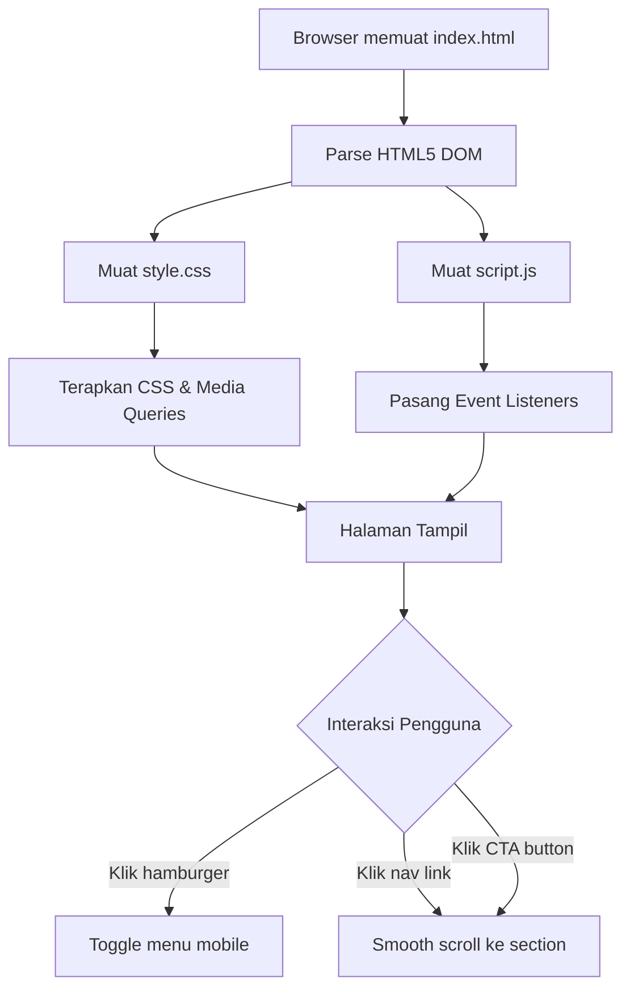
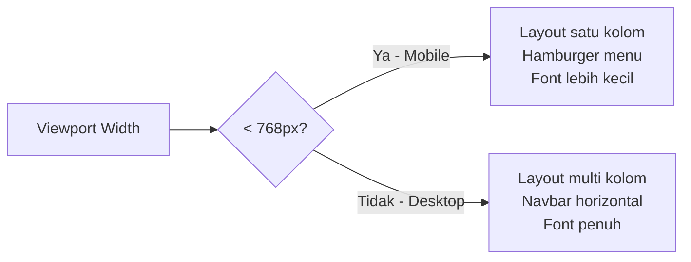

# Dokumen Desain: Simple Landing Page

## Ikhtisar

Landing page ini adalah halaman web tunggal yang dibangun menggunakan teknologi web dasar (HTML5, CSS3, dan Vanilla JavaScript) tanpa framework tambahan. Tujuannya adalah menyajikan konten secara terstruktur, responsif, dan interaktif kepada pengunjung dari berbagai perangkat.

Halaman terdiri dari empat bagian utama yang disusun secara vertikal: Header (dengan navigasi), Hero Section, Feature Section, dan Footer. Interaktivitas ditangani oleh JavaScript murni untuk toggle menu hamburger dan smooth scroll.

### Keputusan Desain Utama

- **Tanpa framework**: Menggunakan HTML5, CSS3, dan Vanilla JavaScript agar ringan dan sesuai tujuan pembelajaran Coding Camp.
- **Mobile-first approach**: CSS ditulis untuk mobile terlebih dahulu, kemudian diperluas untuk desktop menggunakan media query `min-width: 768px`.
- **Progressive enhancement**: Seluruh konten tetap dapat diakses meskipun JavaScript dinonaktifkan.
- **Pemisahan concerns**: HTML untuk struktur, CSS untuk tampilan, JavaScript untuk perilaku — masing-masing dalam file terpisah.

---

## Arsitektur

Proyek ini menggunakan arsitektur halaman statis sederhana dengan tiga file utama:

```
project/
├── index.html      # Struktur dan konten halaman
├── style.css       # Semua styling dan media queries
└── script.js       # Interaktivitas (hamburger toggle, smooth scroll)
```

### Alur Rendering



### Alur Responsivitas



---

## Komponen dan Antarmuka

### 1. Header

**Elemen HTML:**
```html
<header id="header">
  <div class="logo">Nama Proyek</div>
  <nav class="navbar">
    <ul class="nav-links">
      <li><a href="#hero">Beranda</a></li>
      <li><a href="#features">Fitur</a></li>
      <li><a href="#footer">Kontak</a></li>
    </ul>
    <button class="hamburger" aria-label="Toggle menu" aria-expanded="false">
      <span></span><span></span><span></span>
    </button>
  </nav>
</header>
```

**Perilaku:**
- `position: sticky; top: 0` agar tetap terlihat saat scroll
- Hamburger button hanya terlihat pada viewport < 768px
- Klik hamburger: toggle class `active` pada `.nav-links`

### 2. Hero Section

**Elemen HTML:**
```html
<section id="hero">
  <h1>Headline Utama</h1>
  <p>Deskripsi singkat tentang halaman ini.</p>
  <a href="#features" class="cta-button">Lihat Fitur</a>
</section>
```

**Perilaku:**
- `min-height: 100vh` untuk memenuhi seluruh viewport
- Tombol CTA menggunakan anchor link ke `#features`
- Teks dan tata letak menyesuaikan pada mobile

### 3. Feature Section

**Elemen HTML:**
```html
<section id="features">
  <h2>Fitur Utama</h2>
  <div class="feature-grid">
    <div class="feature-card">
      <div class="feature-icon">🚀</div>
      <h3>Judul Fitur 1</h3>
      <p>Deskripsi fitur 1.</p>
    </div>
    <!-- minimal 3 kartu -->
  </div>
</section>
```

**Perilaku:**
- Desktop: `display: grid; grid-template-columns: repeat(3, 1fr)` atau `display: flex`
- Mobile (< 768px): satu kolom vertikal

### 4. Footer

**Elemen HTML:**
```html
<footer id="footer">
  <p>&copy; 2025 Nama Proyek. All rights reserved.</p>
  <a href="mailto:email@example.com">Hubungi Kami</a>
</footer>
```

**Perilaku:**
- Warna latar belakang berbeda dari konten utama (misal: gelap)
- Menampilkan tahun dan informasi kontak

---

## Model Data

Landing page ini tidak memiliki model data dinamis karena seluruh konten bersifat statis. Berikut adalah struktur konten yang perlu didefinisikan:

### Konten Statis

```
LandingPageContent:
  header:
    logoText: string          # Nama atau teks logo
    navLinks: NavLink[]       # Minimal 3 tautan navigasi

  hero:
    headline: string          # Judul utama (h1)
    description: string       # Deskripsi singkat
    ctaLabel: string          # Label tombol CTA
    ctaTarget: string         # ID section tujuan (misal: "#features")

  features:
    sectionTitle: string      # Judul section fitur
    cards: FeatureCard[]      # Minimal 3 kartu

  footer:
    copyrightYear: number     # Tahun hak cipta
    contactInfo: string       # Tautan atau info kontak

NavLink:
  label: string               # Teks tautan
  href: string                # Anchor target (misal: "#hero")

FeatureCard:
  icon: string                # Emoji atau path gambar
  title: string               # Judul kartu
  description: string         # Deskripsi singkat
```

### State JavaScript

```
AppState:
  isMenuOpen: boolean         # Status menu mobile (buka/tutup)
```

State ini dikelola secara implisit melalui CSS class `active` pada elemen `.nav-links`, bukan melalui objek state eksplisit.

---

## Penanganan Error

### Skenario Error dan Penanganannya

| Skenario | Penanganan |
|---|---|
| JavaScript dinonaktifkan | Seluruh konten HTML tetap terlihat; navigasi menggunakan anchor link native browser; hamburger button tidak berfungsi tapi nav links tetap ada di DOM |
| File CSS gagal dimuat | Konten tetap terbaca meski tanpa styling; struktur HTML semantik memastikan keterbacaan dasar |
| File JS gagal dimuat | Smooth scroll menggunakan CSS `scroll-behavior: smooth` sebagai fallback; konten tetap dapat diakses |
| Gambar/ikon gagal dimuat | Gunakan emoji sebagai ikon utama atau tambahkan atribut `alt` yang deskriptif pada `` |
| Anchor link tidak ditemukan | Browser menangani secara native — tidak ada scroll yang terjadi, tidak ada error |

### Strategi Fallback

```css
/* Fallback smooth scroll via CSS jika JS tidak tersedia */
html {
  scroll-behavior: smooth;
}
```

```html
<!-- Hamburger tetap ada di DOM tapi konten nav juga tetap ada untuk no-JS -->
<noscript>
  <style>.hamburger { display: none; } .nav-links { display: flex; }</style>
</noscript>
```

---

## Strategi Pengujian

### Penilaian PBT

Fitur ini adalah landing page statis yang dibangun dengan HTML/CSS/Vanilla JS. Semua acceptance criteria berupa pemeriksaan struktur DOM statis, perilaku CSS, atau interaksi UI sederhana. Tidak ada fungsi murni dengan ruang input yang luas, tidak ada transformasi data, dan tidak ada logika bisnis yang kompleks. Oleh karena itu, **property-based testing tidak applicable** untuk fitur ini.

Sebagai gantinya, pengujian difokuskan pada:
- **Smoke tests**: Verifikasi konfigurasi dan struktur dasar
- **Example-based unit tests**: Verifikasi perilaku spesifik komponen
- **Visual/manual tests**: Verifikasi tampilan dan responsivitas

### Pendekatan Pengujian

#### 1. Smoke Tests (Verifikasi Setup)

Menggunakan HTML validator dan pemeriksaan file:

- Struktur HTML5 valid (`<!DOCTYPE html>`, `<html>`, `<head>`, `<body>`)
- File `style.css` dan `script.js` dimuat secara eksternal
- Meta viewport tag ada dengan nilai yang benar
- Media query 768px terdefinisi di CSS
- Smooth scroll diimplementasikan (CSS atau JS)
- Halaman dapat dimuat tanpa error konsol

#### 2. Example-Based Tests (Verifikasi Komponen)

Menggunakan testing library seperti Jest + jsdom atau Playwright:

**Header & Navigasi:**
- Header menampilkan logo/nama di sisi kiri
- Navbar memiliki minimal 3 tautan dengan format anchor link (`href="#..."`)
- Header memiliki CSS `position: sticky` atau `position: fixed`
- Pada viewport < 768px: hamburger terlihat, nav-links tersembunyi
- Pada viewport ≥ 768px: hamburger tersembunyi, nav-links terlihat

**Hero Section:**
- Elemen `h1` dan paragraf deskripsi ada
- Minimal satu tombol/link CTA ada
- CTA mengarah ke `#features`
- CSS `min-height: 100vh` teraplikasi

**Feature Section:**
- Minimal 3 `.feature-card` ada
- Setiap kartu memiliki ikon/gambar, judul (`h3`), dan deskripsi
- Judul section (`h2`) ada
- CSS `display: grid` atau `display: flex` teraplikasi pada `.feature-grid`

**Footer:**
- Teks copyright ada dan mengandung tahun
- Minimal satu tautan atau info kontak ada
- `background-color` footer berbeda dari `body`

**Tipografi:**
- Computed `font-size` pada elemen `<p>` ≥ 16px

#### 3. Interaction Tests (Verifikasi JavaScript)

Menggunakan Playwright atau Cypress:

- Klik hamburger → menu mobile muncul (class `active` ditambahkan)
- Klik hamburger lagi → menu mobile hilang (class `active` dihapus)
- Klik nav link pada menu mobile → menu tertutup otomatis
- Klik nav link → halaman scroll ke section yang dituju
- Klik CTA button → halaman scroll ke `#features`

#### 4. Responsive Tests (Verifikasi Tata Letak)

Menggunakan Playwright dengan viewport emulation:

- Viewport 375px (mobile): layout satu kolom, hamburger terlihat
- Viewport 1024px (desktop): layout multi kolom, navbar horizontal
- Font size paragraf tetap terbaca di kedua viewport

#### 5. Manual / Visual Tests

- Tampilan keseluruhan halaman di berbagai browser (Chrome, Firefox, Safari)
- Konsistensi palet warna
- Keterbacaan teks pada berbagai ukuran layar
- Aksesibilitas dasar (kontras warna, label ARIA pada hamburger)
